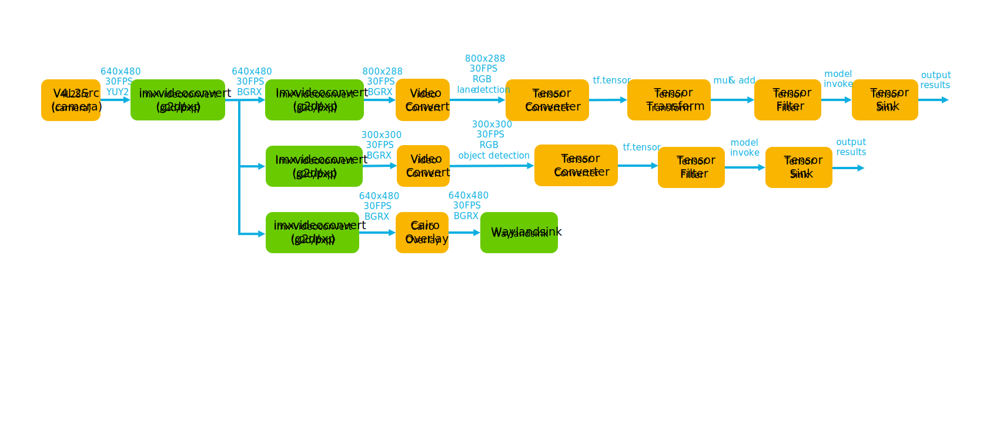

# i.MX Lane Detection

[](./Apache-2.0.txt)
[](https://www.nxp.com/products/processors-and-microcontrollers/arm-processors/i-mx-applications-processors/i-mx-8-applications-processors/i-mx-8m-plus-arm-cortex-a53-machine-learning-vision-multimedia-and-industrial-iot\:IMX8MPLUS)
[](https://www.nxp.com/products/processors-and-microcontrollers/arm-processors/i-mx-applications-processors/i-mx-9-processors/i-mx-93-applications-processor-family-arm-cortex-a55-ml-acceleration-power-efficient-mpu\:i.MX93)

[](https://www.nxp.com/docs/en/user-guide/IMX-MACHINE-LEARNING-UG.pdf)


With the rapid development of the automotive industry in recent years, people have higher and higher requirements for the intelligence of vehicles. Lane detection can be used as a key function of advanced driver assistance systems (ADAS), providing lane keeping assistance, lane departure warning, etc., to enhance the driver's confidence in vehicle control and improve driving safety.

i.MX lane detection application example demonstrates the machine learning (ML) capabilities of i.MX SoC by using the neural processing unit (NPU) to accelerate two deep learning vision-based models. Together, these models detect up to four lane lines and objects (eg\:Car,truck,person,etc.) on the road.

## Table of Contents

1.  [Software Architecture](#1-software-architecture)
2.  [ML Models](#2-ML-models)
3.  [Hardware](#3-hardware)
4.  [Setup](#4-setup)
5.  [Results](#5-results)
6.  [FAQ](#6-FAQ)

## 1 Software Architecture

i.MX lane detection application example uses one GStreamer + NNStreamer pipeline to speed up the application example. 
The GStreamer + NNStreamer pipeline captures the input video frames from the camera or video, detects the up to four lane lines and objects on the road. Two parallel nnstreamer pipelines are used to accelerate the inference of the two models respectively. When lane lines or road objects are detected, the results will drawn on the screen through the cairooverlay element. The simplified block diagram of the pipeline is shown below.



> **NOTE:** On the i.MX 93, *PXP* acceleration is used for the color space conversion and image resizing during pre-processing and display composition. On i.MX 8M Plus, the *2D-GPU(G2D)* accelerator is used for the same purpose. The block diagram takes 2D-GPU acceleration as an example.

## 2 ML Models

i.MX Lane detection application example uses two ML models in total to achieve lane lines detection and object detection. More details about each model is listed below.

### Lane Detection

| Information               | Value                                               |
| ------------------------- | --------------------------------------------------- |
| Input shape               | RGB image \[1, 288, 800, 3]                         |
| Input image preprocessing | mul:0.01735207,add:-2.017699                        |
| Output shape              | \[1, 101, 56, 4]                                    |
| Model size (INT8)         | 58.636 M                                            |
| Source framework          | Ultra-Fast-Lane-Detection(TensorFlow Lite)          |
| Origin                    | <https://github.com/cfzd/Ultra-Fast-Lane-Detection> |

### Object detection

| Information               | Value                                                                                                          |
| ------------------------- | -------------------------------------------------------------------------------------------------------------- |
| Input shape               | RGB image \[1, 300, 300, 3]                                                                                    |
| Input image preprocessing | None (Uint8 Input)                                                                                             |
| Output shape              | TFLite_Detection_PostProcess: <br /> mem_boxes; mem_detections; mem_detections; mem_num |
| MACs                      | 5.933 M                                                                                                        |
| Source framework          | mobilenet\_ssd\_v2\_coco\_quant\_postprocess.tflite                                                            |
| Origin                    | <https://github.com/google-coral/edgetpu/blob/master/test_data/ssd_mobilenet_v2_coco_quant_postprocess.tflite> |

### Benchmarks

The quantized models have been tested on i.MX 8M Plus and i.MX 93 using `./benchmark_model` tool. For i.MX 93, quantized models need to be compiled by vela tool first before using NPU delegate.
(see [i.MX Machine Learning User's Guide](https://www.nxp.com/docs/en/user-guide/IMX-MACHINE-LEARNING-UG.pdf) for more details).

> **NOTE:** Evaluated on BSP LF-6.6.23\_2.0.0.

#### Lane Detection&#x20;

| Platform     | Accelerator     | Avg. Inference Time | Command                                                                                                            |
| ------------ | --------------- | ------------------- | ------------------------------------------------------------------------------------------------------------------ |
| i.MX 8M Plus | CPU (1 thread)  | 1815.70 ms          | ./benchmark\_model --graph=lane\_detection.tflite                                                                  |
| i.MX 8M Plus | CPU (4 threads) | 554.93 ms           | ./benchmark\_model --graph=lane\_detection.tflite --num\_threads=4                                                 |
| i.MX 8M Plus | NPU             | 34.91 ms            | ./benchmark\_model --graph=lane\_detection.tflite --external\_delegate\_path=/usr/lib/libvx\_delegate.so           |
| i.MX 93      | CPU (1 thread)  | 687.47 ms           | ./benchmark\_model --graph=lane\_detection.tflite                                                                  |
| i.MX 93      | CPU (2 threads) | 430.59 ms           | ./benchmark\_model --graph=lane\_detection.tflite --num\_threads=2                                                 |
| i.MX 93      | NPU             | 51.49 ms            | ./benchmark\_model --graph=lane\_detection\_vela.tflite --external\_delegate\_path=/usr/lib/libethosu\_delegate.so |

#### Object Detection model

| Platform     | Accelerator     | Avg. Inference Time | Command                                                                                                                                         |
| ------------ | --------------- | ------------------- | ----------------------------------------------------------------------------------------------------------------------------------------------- |
| i.MX 8M Plus | CPU (1 thread)  | 244.64 ms           | ./benchmark\_model --graph=mobilenet\_ssd\_v2\_coco\_quant\_postprocess.tflite                                                                  |
| i.MX 8M Plus | CPU (4 threads) | 74.25 ms            | ./benchmark\_model --graph=mobilenet\_ssd\_v2\_coco\_quant\_postprocess.tflite --num\_threads=4                                                 |
| i.MX 8M Plus | NPU             | 11.03 ms            | ./benchmark\_model --graph=mobilenet\_ssd\_v2\_coco\_quant\_postprocess.tflite --external\_delegate\_path=/usr/lib/libvx\_delegate.so           |
| i.MX 93      | CPU (1 thread)  | 111.35 ms           | ./benchmark\_model --graph=mobilenet\_ssd\_v2\_coco\_quant\_postprocess.tflite                                                                  |
| i.MX 93      | CPU (2 threads) | 65.68 ms            | ./benchmark\_model --graph=mobilenet\_ssd\_v2\_coco\_quant\_postprocess.tflite --num\_threads=2                                                 |
| i.MX 93      | NPU             | 12.77 ms            | ./benchmark\_model --graph=mobilenet\_ssd\_v2\_coco\_quant\_postprocess\_vela.tflite --external\_delegate\_path=/usr/lib/libethosu\_delegate.so |

## 3 Hardware

To run i.MX Lane Detection application example, either the i.MX 8M Plus or i.MX 93 EVKs are required with their respective hardware components.

| Component                                         |     i.MX 8M Plus     |        i.MX 93       |
| ------------------------------------------------- | :------------------: | :------------------: |
| Power Supply                                      |  :white_check_mark:  |  :white_check_mark:  |
| HDMI Display                                      |  :white_check_mark:  |  :white_check_mark:  |
| USB micro-B cable (Type-A male to Micro-B male)   |  :white_check_mark:  |                      |
| USB Type-C cable  (Type-A male to Type-C male)    |                      |  :white_check_mark:  |
| HDMI cable                                        |  :white_check_mark:  |  :white_check_mark:  |
| IMX-MIPI-HDMI (MIPI-DSI to HDMI adapter)          |                      |  :white_check_mark:  |
| Mini-SAS cable                                    |                      |  :white_check_mark:  |
| MIPI-CSI camera module                            |  :white_check_mark:  |  :white_check_mark:  |
| USB camera (optional, if no MIPI-CSI camera used) |  :white_check_mark:  |  :white_check_mark:  |
| Mouse                                             |  :white_check_mark:  |  :white_check_mark:  |

## 4 Setup

### Support Board:

i.MX8MPEVK or i.MX93EVK

### Download the project

```bash
git clone <this project>
```

### Cross compile:

After enable the cross compiler, compile the application example following the commands below:

```bash
:imx-lane-detection$ mkdir build
:imx-lane-detection$ cd build
:imx-lane-detection/build$ camke .. 
:imx-lane-detection$ make -j8
```

### Run the application example

#### ON PC:

1\. Copy the executable programs, models, videos (if needed) to the i.MX8MPEVK or i.MX93EVK.

```bash
:imx-lane-detection$ scp ./build/lane_detection root@<your board IP>:<your path>
:imx-lane-detection/build$ scp -r models/ root@<your board IP>:<your path>
:imx-lane-detection$ scp  lane_detection.mp4  root@<your board IP>:<your path>
```
#### ON Board:

```bash
:$ ./lane_detection --help
Usage: lane_detection application example [options]
Options:
-h, Display this help and exit
-s, set video source or camera source default by video source (eg: -s camera or -s video)
-v, The video name. Must set video name if use your video (eg: -s video -v lane_detection.mp4)
-c, The centor pixel of the car default by 320.0 (eg: -c 320.0)
-l, The length of the car default by 280.0 (eg: -i 280.0)

# run the application example by video source
:$ ./lane_detection
```

Exit the program using the "ctrl + \\" key.

## 5 Results

In the upper left corner of the screen

*   FPS represents the frame rate of the entire application example pipeline.
*   OBJ represents the number of objects detected in the current frame.
*   Deviation represents the proportion of the vehicle deviating from the center of the lane line, where \[L] means deviation to the left and \[R] means deviation to the right.
*   When the vehicle does not hit the lane line, "Good Lane Keeping" will be displayed, and when the vehicle hits the lane line, "Warning! OFF Lane" will be displayed.


## 6 FAQ
By default, the i.MX93EVK official [BSP](https://www.nxp.com/design/design-center/software/embedded-software/i-mx-software/embedded-linux-for-i-mx-applications-processors:IMXLINUX) does not enable the avdec_h264 element in gstreamer to decode the video stream. If you want to use i.MX93EVK to demonstrate this demo through video source, it is recommended to use BSP 6.6.23_2.0.0 or above, and refer to Section 7.5 "Installing gstreamer1.0-libav into rootfs" of the official [IMX_LINUX_USERS_GUIDE](https://www.nxp.com.cn/docs/en/user-guide/IMX_LINUX_USERS_GUIDE.pdf) to enable the gstreamer1.0-libav.

## Licensing

i.MX Lane detection application example is licensed under the [Apache-2.0 License](https://www.apache.org/licenses/LICENSE-2.0) .

Lane detection model is licensed under the [MIT License](https://opensource.org/license/mit).

Object detection model is licensed under the [Apache-2.0 License](https://www.apache.org/licenses/LICENSE-2.0).
